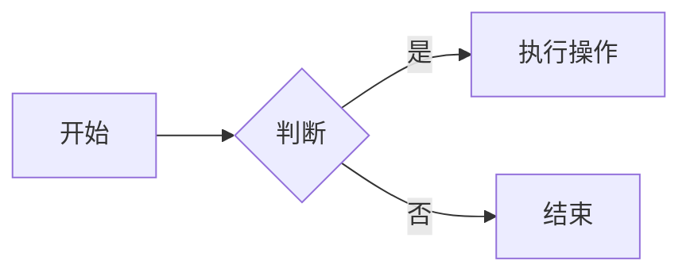

# C#学习心得

## **好用的链接：**

### **1、好用的链接**

[使用VisualStudio2022插件(Visual Studio Installer Projects 2022)打包 .Net 6/.Net 8 框架下的 WPF项目 为 msi安装文件_microsoft visual studio installer projects 2022-CSDN博客](https://blog.csdn.net/syzcyyx/article/details/129482721)

下载插件：[Microsoft Visual Studio Installer Projects 2022 - Visual Studio Marketplace](https://marketplace.visualstudio.com/items?itemName=VisualStudioClient.MicrosoftVisualStudio2022InstallerProjects)

视频教程：[C#程序打包成Setup安装包发布_哔哩哔哩_bilibili](https://www.bilibili.com/video/BV1n84y1271i/?spm_id_from=333.337.search-card.all.click&vd_source=c67b1bafe6c6e5f13697aa9dc44369a1)

[27款液晶数字英文字体|字体下载](https://www.ztxz.cc/258.html)  ，安装只需要把字体文件复制到C:\Windows\Fonts目录下就会自动安装。

### **2、强制显示小数**

在 C# 中，`ToString()` 方法可以接受一个 **格式字符串（format string）** 来控制数值的显示方式。`"F1"` 是一种标准数字格式字符串（Standard Numeric Format String），它的作用是：

- **`F`** 表示 **"Fixed-point"（定点数）**，即强制以小数形式显示数字。
- **`1`** 表示 **保留1位小数**。

------

#### `"F1"` 的详细解释

**（1）`F` 代表 Fixed-point（定点数）**

- 它会强制将数字转换为 **带小数的形式**，即使原始值是整数。

- 例如：

  ```csharp
  123.ToString("F1")   // 输出 "123.0"
  51.3.ToString("F1")  // 输出 "51.3"
  ```

**（2）`1` 表示保留1位小数**

- 它会 **四舍五入** 到指定的小数位数。

- 例如：

  ```csharp
  51.34.ToString("F1")  // 输出 "51.3"（四舍五入）
  51.36.ToString("F1")  // 输出 "51.4"（四舍五入）
  ```

------

#### 其他常见的数字格式字符串

| 格式字符串 |            作用            |         示例         |
| :--------: | :------------------------: | :------------------: |
|   `"F0"`   |     不保留小数（整数）     |    `51.3 → "51"`     |
|   `"F1"`   |        保留1位小数         |   `51.3 → "51.3"`    |
|   `"F2"`   |        保留2位小数         |   `51.3 → "51.30"`   |
|   `"N1"`   |   带千位分隔符 + 1位小数   | `1234.5 → "1,234.5"` |
|  `"0.0"`   | 强制显示1位小数（即使为0） |    `51 → "51.0"`     |
|   `"P1"`   |   百分比格式（1位小数）    |  `0.513 → "51.3%"`   |

### 3、LIVOLTEK协议

#### Ⅰ、Communication frame format

Device query command format

|  index   |      1      |       2       |           3           |        4         |        5         |
| :------: | :---------: | :-----------: | :-------------------: | :--------------: | :--------------: |
| Function |  Slave ID   | Command type  | Start Address of data |   Data Length    |       *CRC       |
|  Bytes   |      1      |       1       |           2           |        2         |        2         |
|          | BMS address | Function code |   \| MSB \| LSB \|    | \| MSB \| LSB \| | \| LSB \| MSB \| |

*The CRC check range is all of the bytes before the CRC field.

Command type table

| Index | Command type | Description |
| :---: | :----------: | :---------: |
|   1   |     0x03     |  Read Data  |
|   2   |     0x06     | Write Data  |

BMS normal response format

| Index    | 1           | 2             | 3           | 4                | 5               |
| -------- | ----------- | ------------- | ----------- | ---------------- | --------------- |
| Function | Slave ID    | Command type  | Data Length | Data information | CRC             |
| Bytes    | 1           | 1             | 1           | Data length*2    | 2               |
|          | BMS address | Function code |             | \| MSB \|LSB \|  | \| LSB \|MSB \| |


#### Ⅱ、上位机寄存器点表

基础地址：0x2000：

实际地址 = 基础地址 + 偏移地址

##### ①基本参数

|    参数说明     | 地址 | 单位 | 是否16进制显示 | byte | 读写权限 | 值HEX | DEC  |
| :-------------: | :--: | :--: | :------------: | :--: | :------: | :---: | :--: |
|     总电压      | 100  |  V   |     FALSE      |  2   |   Read   | 0200  | 51.2 |
|     总电流      | 101  |  A   |     FALSE      |  2   |   Read   | 0000  |  0   |
|   充放电指示    | 102  |  --  |     FALSE      |  2   |   Read   | 0000  |  0   |
|       SOC       | 103  |  %   |     FALSE      |  2   |   Read   | 0064  |  10  |
|       SOH       | 104  |  %   |     FALSE      |  2   |   Read   | 03E7  | 99.9 |
|  最大电压编号   | 105  |  --  |     FALSE      |  2   |   Read   | 0010  |  16  |
|  最大单体电压   | 106  |  mV  |     FALSE      |  2   |   Read   | 0C88  | 3208 |
|  最小电压编号   | 107  |  --  |     FALSE      |  2   |   Read   | 0002  |  2   |
|  最小单体电压   | 108  |  mV  |     FALSE      |  2   |   Read   | 0C85  | 3205 |
|  最高温度编号   | 109  |  --  |     FALSE      |  2   |   Read   | 0001  |  1   |
|    最高温度     | 10A  |  ℃   |     FALSE      |  2   |   Read   | 0102  | 25.8 |
|  最低温度编号   | 10B  |  --  |     FALSE      |  2   |   Read   | 0002  |  2   |
|    最低温度     | 10C  |  ℃   |     FALSE      |  2   |   Read   | 0100  | 25.6 |
|    复位次数     | 10D  |  T   |     FALSE      |  2   |   Read   | 0124  | 292  |
|     Mos温度     | 10E  |  ℃   |     FALSE      |  2   |   Read   | 0112  | 27.4 |
|    环境温度     | 10F  |  ℃   |     FALSE      |  2   |   Read   | 0138  | 31.2 |
|    均衡温度     | 110  |  ℃   |     FALSE      |  2   |   Read   | 0126  | 29.4 |
|  功能安全异常   | 111  |  --  |      TRUE      |  2   |   Read   | 0000  |  0   |
|  第2路采样电流  | 112  |  A   |     FALSE      |  2   |   Read   | 0000  |  0   |
|                 | 113  |      |                |      |          | 0000  |  0   |
|    平均电压     | 114  |  mV  |     FALSE      |  2   |   Read   | 0C85  | 3205 |
|                 | 115  |      |                |      |          |       |      |
|                 | 116  |      |                |      |          |       |      |
|    最大压差     | 117  |  --  |     FALSE      |  2   |   Read   |       |      |
|                 | 118  |      |                |      |          |       |      |
|                 | 119  |      |                |      |          |       |      |
|  最大充电电流   | 120  |  A   |     FALSE      |  2   |   Read   | 01F4  |  50  |
|  最大放电电流   | 121  |  A   |     FALSE      |  2   |   Read   | 02EE  |  75  |
|  功能安全故障   | 122  |      |     FALSE      |  2   |   Read   | 0000  |  0   |
| 功能安全温度值  | 123  |  ℃   |     FALSE      |  2   |   Read   | 0000  |  0   |
| 第9节电压实际值 | 124  |  mV  |     FALSE      |  2   |   Read   | 0C86  | 3206 |
|  限流板温度值   | 125  |  ℃   |     FALSE      |  2   |   Read   | 010C  | 26.8 |
| 实际最高电压值  | 126  |  mV  |     FALSE      |  2   |   Read   | 0C88  | 3208 |
|     显示SOC     | 127  |  ℃   |     FALSE      |  2   |   Read   | 0064  |  10  |


##### ②电芯单体值

|    参数说明    | 地址 | 单位 | 是否16进制显示 | byte | 读写权限 |
| :------------: | :--: | :--: | :------------: | :--: | :------: |
| 第1节电芯电压  | 800  |  mV  |     FALSE      |  2   |   Read   |
| 第2节电芯电压  | 801  |  mV  |     FALSE      |  2   |   Read   |
| 第3节电芯电压  | 802  |  mV  |     FALSE      |  2   |   Read   |
| 第4节电芯电压  | 803  |  mV  |     FALSE      |  2   |   Read   |
| 第5节电芯电压  | 804  |  mV  |     FALSE      |  2   |   Read   |
| 第6节电芯电压  | 805  |  mV  |     FALSE      |  2   |   Read   |
| 第7节电芯电压  | 806  |  mV  |     FALSE      |  2   |   Read   |
| 第8节电芯电压  | 807  |  mV  |     FALSE      |  2   |   Read   |
| 第9节电芯电压  | 808  |  mV  |     FALSE      |  2   |   Read   |
| 第10节电芯电压 | 809  |  mV  |     FALSE      |  2   |   Read   |
| 第11节电芯电压 | 80A  |  mV  |     FALSE      |  2   |   Read   |
| 第12节电芯电压 | 80B  |  mV  |     FALSE      |  2   |   Read   |
| 第13节电芯电压 | 80C  |  mV  |     FALSE      |  2   |   Read   |
| 第14节电芯电压 | 80D  |  mV  |     FALSE      |  2   |   Read   |
| 第15节电芯电压 | 80E  |  mV  |     FALSE      |  2   |   Read   |
| 第16节电芯电压 | 80F  |  mV  |     FALSE      |  2   |   Read   |
|                |      |      |                |      |          |
| 第1节电芯温度  | C00  | 0.1℃ |     FALSE      |  2   |   Read   |
| 第2节电芯温度  | C01  | 0.1℃ |     FALSE      |  2   |   Read   |
| 第3节电芯温度  | C02  | 0.1℃ |     FALSE      |  2   |   Read   |
| 第4节电芯温度  | C03  | 0.1℃ |     FALSE      |  2   |   Read   |
| 第5节电芯温度  | C04  | 0.1℃ |     FALSE      |  2   |   Read   |
| 第6节电芯温度  | C05  | 0.1℃ |     FALSE      |  2   |   Read   |
| 第7节电芯温度  | C06  | 0.1℃ |     FALSE      |  2   |   Read   |
| 第8节电芯温度  | C07  | 0.1℃ |     FALSE      |  2   |   Read   |

发送：01 03 21 00 00 28 4F E8

回复：01 03 50 02 00 00 00 00 00 00 5A 03 E7 00 10 0C 85 00 07 0C 82 00 01 00 F9 00 02 00 F7 01 24 01 09 01 31 01 1E 00 00 00 00 00 00 0C 83 01 31 00 00 00 03 00 00 00 00 00 00 00 00 00 00 00 00 00 00 00 00 01 F4 00 00 00 00 00 00 0C 83 01 04 0C 85 00 5A 6D F1 。

解析：

02 00 00 00 00 00 00 64 03 E7 00 10 0C 86 00 06 0C 83 00 01 00 FB 00 02 00 F8 01 24 01 0B 01 32 01 20 00 00 00 00 总电压-第2路采样电流【data0-data37】

00 00 

0C 83 平均电压【data40-data41】

01 32 

00 00 

00 03 最大压差【data46-data47】

00 00 

00 00 

00 00 

00 00 

00 00 

00 00 

00 00 

00 00 

01 F4 02 EE 00 00 00 00 0C 84 01 06 0C 86 00 64最大充电电流-显示SOC【data64-data79】


##### ③读取版本号：

发送：30 78 31 30 38 30 20 53 68 6F 77 56 65 72 73 69 6F 6E

接收：53 4F 46 54 3A 20 56 30 2E 35 2E 30 2E 38 35 2E 30 20 45 45 50 52 4F 4D 3A 20 30 78 38 42 43 44 45 30 31 42 0D 0A 

V5.0.85


版本号：

[23:20:41.230]发→◇01 03 21 89 00 09 5E 1A □
[23:20:41.263]收←◆01 03 12 00 00 00 05 00 01 00 17 00 00 00 01 00 00 00 03 42 4C AA 21 


##### ④读取主控配置

|            参数说明             |  地址   | 单位  | 是否16进制显示 | byte |  读写权限  |
| :-----------------------------: | :-----: | :---: | :------------: | :--: | :--------: |
|     蜂鸣器报警使能开关00 01     |   00    |   -   |     FALSE      |  2   | Write/Read |
|          MOS状态02 03           |   01    |   -   |     FALSE      |  2   | Write/Read |
|              04 05              |   02    |       |                |      |            |
|              06 07              |   03    |       |                |      |            |
|          系统复位08 09          |   04    |   -   |     FALSE      |  2   | Write/Read |
|        系统运行模式10 11        |   05    |   -   |     FALSE      |  2   | Write/Read |
|          限流状态12 13          |   06    |   -   |     FALSE      |  2   | Write/Read |
|  告警功能开关（复位生效）14 15  |   07    |  Hex  |      TRUE      |  2   | Write/Read |
|  保护功能开关（复位生效）16 17  |   08    |  Hex  |      TRUE      |  2   | Write/Read |
|              18 19              |   09    |       |                |      |            |
|              20 21              |   0A    |       |                |      |            |
|              22 23              |   0B    |       |                |      |            |
|              24 25              |   0C    |       |                |      |            |
|              26 27              |   0D    |       |                |      |            |
|              28 29              |   0E    |       |                |      |            |
|              30 31              |   0F    |       |                |      |            |
|              32 33              |   10    |       |                |      |            |
|              34 35              |   11    |       |                |      |            |
|              36 37              |   12    |       |                |      |            |
|              38 39              |   13    |       |                |      |            |
|              40 41              |   14    |       |                |      |            |
|              42 43              |   15    |       |                |      |            |
|              44 45              |   16    |       |                |      |            |
|         复位EepRom46 47         |   17    |   -   |     FALSE      |  2   | Write/Read |
|              48 49              |   18    |       |                |      |            |
|              50 51              |   19    |       |                |      |            |
|              52 53              |   1A    |       |                |      |            |
|          工厂模式54 55          |   1B    |   -   |     FALSE      |  2   | Write/Read |
|          强制控制56 57          |   1C    |   -   |     FALSE      |  2   | Write/Read |
|          强控均衡58 59          |   1D    |   -   |      TRUE      |  2   | Write/Read |
|              60 61              |   1E    |       |                |      |            |
|        进入休眠功能62 63        |   1F    |   -   |     FALSE      |  2   | Write/Read |
|          外部控制64 65          |   20    |   -   |      TRUE      |  2   | Write/Read |
|        并联充电状态66 67        |   21    |   -   |     FALSE      |  2   | Write/Read |
|          通信测试68 69          |   22    |   -   |     FALSE      |  2   | Write/Read |
|          LED测试70 71           |   23    |   -   |     FALSE      |  2   | Write/Read |
|          清除LOG72 73           |   24    |   -   |     FALSE      |  2   | Write/Read |
|        强控干接点1 74 75        |   25    |   -   |     FALSE      |  2   | Write/Read |
|        强控干接点2 76 77        |   26    |   -   |     FALSE      |  2   | Write/Read |
|        通讯协议版本78 79        |   27    |   -   |     FALSE      |  2   | Write/Read |
|                                 | ---中断 |       |                |      |            |
|      充电过流重试次数00 01      |   40    |   -   |     FALSE      |  2   | Write/Read |
| 充电过流特殊处理时恢复时间02 03 |   41    |  min  |     FALSE      |  2   | Write/Read |
|      放电过流重试次数04 05      |   42    |   -   |     FALSE      |  2   | Write/Read |
| 放电过流特殊处理时恢复时间06 07 |   43    |  min  |     FALSE      |  2   | Write/Read |
|      充电定时恢复时间08 09      |   44    |  min  |     FALSE      |  2   | Write/Read |
|      放电定时恢复时间10 11      |   45    |  min  |     FALSE      |  2   | Write/Read |
|        单体电压数量12 13        |   46    |   -   |     FALSE      |  2   | Write/Read |
|          温度数量14 15          |   47    |   -   |     FALSE      |  2   | Write/Read |
|   均衡单体电压过高保护值16 17   |   48    |  mV   |     FALSE      |  2   | Write/Read |
|   均衡单体电压过低保护值18 19   |   49    |  mV   |     FALSE      |  2   | Write/Read |
|  均衡单体电压差过高保护值20 21  |   4A    |  mV   |     FALSE      |  2   | Write/Read |
|     均衡温度过高保护值22 23     |   4B    | 0.1℃  |     FALSE      |  2   | Write/Read |
|   <u>**24 25（有数据）**</u>    |   4C    |       |                |      |            |
|              26 27              |   4D    |       |                |      |            |
|              28 29              |   4E    |       |                |      |            |
|       均衡使能标志位30 31       |   4F    |   -   |     FALSE      |  2   | Write/Read |
|              32 33              |   50    |       |                |      |            |
|              34 35              |   51    |       |                |      |            |
|              36 37              |   52    |       |                |      |            |
|              38 39              |   53    |       |                |      |            |
|              40 41              |   54    |       |                |      |            |
|              42 43              |   55    |       |                |      |            |
|              44 45              |   56    |       |                |      |            |
|        充电截止电压46 47        |   57    | 0.1V  |     FALSE      |  2   | Write/Read |
|              48 49              |   58    |       |                |      |            |
|              50 51              |   59    |       |                |      |            |
|              52 53              |   5A    |       |                |      |            |
|          PCS类型54 55           |   5B    |   -   |     FALSE      |  2   | Write/Read |
|          并联地址56 57          |   5C    |   -   |     FALSE      |  2   | Write/Read |
|          LED类型58 59           |   5D    |   -   |     FALSE      |  2   | Write/Read |
|     功能安全温差保护值60 61     |   5E    |   -   |     FALSE      |  2   | Write/Read |
|          强控Mos62 63           |   5F    |   -   |     FALSE      |  2   | Write/Read |
|       均衡强控标志位64 65       |   60    |   -   |     FALSE      |  2   | Write/Read |
|                                 | ---中断 |       |                |      |            |
|        电流校准系数00 01        |   C2    |   -   |     FALSE      |  2   | Write/Read |
|       电流校准偏移量02 03       |   C3    | 0.01A |     FALSE      |  2   | Write/Read |
|        充电降流电压04 05        |   C4    |  mV   |     FALSE      |  2   | Write/Read |
|          小电流值06 07          |   C5    | 0.1A  |     FALSE      |  2   | Write/Read |
|       小电流进入次数08 09       |   C6    |   1   |     FALSE      |  2   | Write/Read |
|       小电流持续时间10 11       |   C7    | 0.1s  |     FALSE      |  2   | Write/Read |
|              12 13              |   C8    |       |                |      |            |
|              14 15              |   C9    |       |                |      |            |
|        满充电压门限16 17        |   CA    | 0.1mV |     FALSE      |  2   | Write/Read |
|        满充电流门限18 19        |   CB    | 0.1A  |     FALSE      |  2   | Write/Read |
|        系统标称容量20 21        |   CC    |  1Ah  |     FALSE      |  2   | Write/Read |
|              22 23              |   CD    |       |                |      |            |
|              24 25              |   CE    |       |                |      |            |
|              26 27              |   CF    |       |                |      |            |
|              28 29              |   D0    |       |                |      |            |
|        存储间隔时间30 31        |   D1    |   s   |     FALSE      |  2   | Write/Read |
|              32 33              |   D2    |       |                |      |            |
|              34 35              |   D3    |       |                |      |            |
|              36 37              |   D4    |       |                |      |            |
|              38 39              |   D5    |       |                |      |            |
|        充电限流模式40 41        |   D6    |   -   |     FALSE      |  2   | Write/Read |
|              42 43              |   D7    |       |                |      |            |
|              44 45              |   D8    |       |                |      |            |
|    **动态均衡开启电压46 47**    |   D9    |  mV   |     FALSE      |  2   | Write/Read |
|      动态均衡开启压差48 49      |   DA    |  mV   |     FALSE      |  2   | Write/Read |
|              50 51              |   DB    |       |                |      |            |
|        均衡结束压差52 53        |   DC    |  mV   |     FALSE      |  2   | Write/Read |
|              54 55              |   DD    |       |                |      |            |
|       系统当前总容量56 57       |   DE    | 0.1Ah |     FALSE      |  2   | Write/Read |
|      一级限流总压门限58 59      |   DF    | 0.1V  |     FALSE      |  2   | Write/Read |
|      二级限流总压门限60 61      |   E0    | 0.1V  |     FALSE      |  2   | Write/Read |
|              62 63              |   E1    |       |                |      |            |
|        电流零点范围64 65        |   E2    | 0.01A |     FALSE      |  2   | Write/Read |
|   <u>**66 67（有数据）**</u>    |   E3    |       |                |      |            |
|              68 69              |   E4    |       |                |      |            |
|              70 71              |   E5    |       |                |      |            |
|  清除所有单体和电流校准数72 73  |   E6    |   -   |     FALSE      |  2   | Write/Read |
|         系统SOC  74 75          |   E7    | 0.1%  |     FALSE      |  2   | Write/Read |
|             年76 77             |   E8    |   -   |     FALSE      |  2   | Write/Read |
|             月78 79             |   E9    |   -   |     FALSE      |  2   | Write/Read |
|             日80 81             |   EA    |   -   |     FALSE      |  2   | Write/Read |
|             周82 83             |   EB    |   -   |     FALSE      |  2   | Write/Read |
|             时84 85             |   EC    |   -   |     FALSE      |  2   | Write/Read |
|             分86 87             |   ED    |   -   |     FALSE      |  2   | Write/Read |
|             秒88 89             |   EE    |   -   |     FALSE      |  2   | Write/Read |
|        短路保护延时90 91        |   EF    | 0.1ms |     FALSE      |  2   | Write/Read |
|        反接保护延时92 93        |   F0    | 0.1ms |     FALSE      |  2   | Write/Read |
|        静置休眠电压94 95        |   F1    |  mV   |     FALSE      |  2   | Write/Read |
|              96 97              |   F2    |       |                |      |            |
|              98 99              |   F3    |       |                |      |            |
|             100 101             |   F4    |       |                |      |            |
|             102 103             |   F5    |       |                |      |            |
|             104 105             |   F6    |       |                |      |            |
|             106 107             |   F7    |       |                |      |            |
|     静置休眠延时时间108 109     |   F8    |  min  |     FALSE      |  2   | Write/Read |
|     正常休眠所需时间110 111     |   F9    |  min  |     FALSE      |  2   | Write/Read |
|     欠压休眠所需时间112 113     |   FA    |  min  |     FALSE      |  2   | Write/Read |
|     手动休眠所需时间114 115     |   FB    |  min  |     FALSE      |  2   | Write/Read |
|      系统总放电容量116 117      |   FC    |  Ah   |     FALSE      |  2   | Write/Read |
|      系统总放电容量118 119      |   FD    |  Ah   |     FALSE      |  2   | Write/Read |
|      系统总充电容量120 121      |   FE    |  Ah   |     FALSE      |  2   | Write/Read |
|      系统总充电容量122 123      |   FF    |  Ah   |     FALSE      |  2   | Write/Read |
|                                 | ---中断 |       |                |      |            |
|            休眠方式             |   1B4   |   -   |     FALSE      |  2   | Write/Read |
|            唤醒方式             |   1B5   |   -   |     FALSE      |  2   | Write/Read |
|                                 |         |       |                |      |            |
|          单体1校准系数          |   400   |   -   |     FALSE      |  2   | Write/Read |
|         单体1校准偏移值         |   401   |  mV   |     FALSE      |  2   | Write/Read |
|          单体2校准系数          |   402   |   -   |     FALSE      |  2   | Write/Read |
|         单体2校准偏移值         |   403   |  mV   |     FALSE      |  2   | Write/Read |
|          单体3校准系数          |   404   |   -   |     FALSE      |  2   | Write/Read |
|         单体3校准偏移值         |   405   |  mV   |     FALSE      |  2   | Write/Read |
|          单体4校准系数          |   406   |   -   |     FALSE      |  2   | Write/Read |
|         单体4校准偏移值         |   407   |  mV   |     FALSE      |  2   | Write/Read |
|          单体5校准系数          |   408   |   -   |     FALSE      |  2   | Write/Read |
|         单体5校准偏移值         |   409   |  mV   |     FALSE      |  2   | Write/Read |
|          单体6校准系数          |   40A   |   -   |     FALSE      |  2   | Write/Read |
|         单体6校准偏移值         |   40B   |  mV   |     FALSE      |  2   | Write/Read |
|          单体7校准系数          |   40C   |   -   |     FALSE      |  2   | Write/Read |
|         单体7校准偏移值         |   40D   |  mV   |     FALSE      |  2   | Write/Read |
|          单体8校准系数          |   40E   |   -   |     FALSE      |  2   | Write/Read |
|         单体8校准偏移值         |   40F   |  mV   |     FALSE      |  2   | Write/Read |
|          单体9校准系数          |   410   |   -   |     FALSE      |  2   | Write/Read |
|         单体9校准偏移值         |   411   |  mV   |     FALSE      |  2   | Write/Read |
|         单体10校准系数          |   412   |   -   |     FALSE      |  2   | Write/Read |
|        单体10校准偏移值         |   413   |  mV   |     FALSE      |  2   | Write/Read |
|         单体11校准系数          |   414   |   -   |     FALSE      |  2   | Write/Read |
|        单体11校准偏移值         |   415   |  mV   |     FALSE      |  2   | Write/Read |
|         单体12校准系数          |   416   |   -   |     FALSE      |  2   | Write/Read |
|        单体12校准偏移值         |   417   |  mV   |     FALSE      |  2   | Write/Read |
|         单体13校准系数          |   418   |   -   |     FALSE      |  2   | Write/Read |
|        单体13校准偏移值         |   419   |  mV   |     FALSE      |  2   | Write/Read |
|         单体14校准系数          |   41A   |   -   |     FALSE      |  2   | Write/Read |
|        单体14校准偏移值         |   41B   |  mV   |     FALSE      |  2   | Write/Read |
|         单体15校准系数          |   41C   |   -   |     FALSE      |  2   | Write/Read |
|        单体15校准偏移值         |   41D   |  mV   |     FALSE      |  2   | Write/Read |
|         单体16校准系数          |   41E   |   -   |     FALSE      |  2   | Write/Read |
|        单体16校准偏移值         |   41F   |  mV   |     FALSE      |  2   | Write/Read |
|         单体17校准系数          |   420   |   -   |     FALSE      |  2   | Write/Read |
|        单体17校准偏移值         |   421   |  mV   |     FALSE      |  2   | Write/Read |
|         单体18校准系数          |   422   |   -   |     FALSE      |  2   | Write/Read |
|        单体18校准偏移值         |   423   |  mV   |     FALSE      |  2   | Write/Read |
|         单体19校准系数          |   424   |   -   |     FALSE      |  2   | Write/Read |
|        单体19校准偏移值         |   425   |  mV   |     FALSE      |  2   | Write/Read |
|         单体20校准系数          |   426   |   -   |     FALSE      |  2   | Write/Read |
|        单体20校准偏移值         |   427   |  mV   |     FALSE      |  2   | Write/Read |
|         单体21校准系数          |   428   |   -   |     FALSE      |  2   | Write/Read |
|        单体21校准偏移值         |   429   |  mV   |     FALSE      |  2   | Write/Read |
|         单体22校准系数          |   42A   |   -   |     FALSE      |  2   | Write/Read |
|        单体22校准偏移值         |   42B   |  mV   |     FALSE      |  2   | Write/Read |
|         单体23校准系数          |   42C   |   -   |     FALSE      |  2   | Write/Read |
|        单体23校准偏移值         |   42D   |  mV   |     FALSE      |  2   | Write/Read |
|         单体24校准系数          |   42E   |   -   |     FALSE      |  2   | Write/Read |
|        单体24校准偏移值         |   42F   |  mV   |     FALSE      |  2   | Write/Read |
|                                 |         |       |                |      |            |
|         温度1校准偏移值         |   E00   |   ℃   |     FALSE      |  2   | Write/Read |
|         温度2校准偏移值         |   E01   |   ℃   |     FALSE      |  2   | Write/Read |
|         温度3校准偏移值         |   E02   |   ℃   |     FALSE      |  2   | Write/Read |
|         温度4校准偏移值         |   E03   |   ℃   |     FALSE      |  2   | Write/Read |
|         温度5校准偏移值         |   E04   |   ℃   |     FALSE      |  2   | Write/Read |
|         温度6校准偏移值         |   E05   |   ℃   |     FALSE      |  2   | Write/Read |
|         温度7校准偏移值         |   E06   |   ℃   |     FALSE      |  2   | Write/Read |
|         温度8校准偏移值         |   E07   |   ℃   |     FALSE      |  2   | Write/Read |
|         温度9校准偏移值         |   E08   |   ℃   |     FALSE      |  2   | Write/Read |
|        温度10校准偏移值         |   E09   |   ℃   |     FALSE      |  2   | Write/Read |
|        温度11校准偏移值         |   E0A   |   ℃   |     FALSE      |  2   | Write/Read |
|        温度12校准偏移值         |   E0B   |   ℃   |     FALSE      |  2   | Write/Read |
|        温度13校准偏移值         |   E0C   |   ℃   |     FALSE      |  2   | Write/Read |
|        温度14校准偏移值         |   E0D   |   ℃   |     FALSE      |  2   | Write/Read |
|        温度15校准偏移值         |   E0E   |   ℃   |     FALSE      |  2   | Write/Read |
|        温度16校准偏移值         |   E0F   |   ℃   |     FALSE      |  2   | Write/Read |
|        温度17校准偏移值         |   E10   |   ℃   |     FALSE      |  2   | Write/Read |
|        温度18校准偏移值         |   E11   |   ℃   |     FALSE      |  2   | Write/Read |
|        温度19校准偏移值         |   E12   |   ℃   |     FALSE      |  2   | Write/Read |
|        温度20校准偏移值         |   E13   |   ℃   |     FALSE      |  2   | Write/Read |
|        温度21校准偏移值         |   E14   |   ℃   |     FALSE      |  2   | Write/Read |
|        温度22校准偏移值         |   E15   |   ℃   |     FALSE      |  2   | Write/Read |
|        温度23校准偏移值         |   E16   |   ℃   |     FALSE      |  2   | Write/Read |
|        温度24校准偏移值         |   E17   |   ℃   |     FALSE      |  2   | Write/Read |
|                                 |         |       |                |      |            |
|         线组1校准偏移值         |   F00   |  uΩ   |     FALSE      |  2   | Write/Read |
|         线组2校准偏移值         |   F01   |  uΩ   |     FALSE      |  2   | Write/Read |
|         线组3校准偏移值         |   F02   |  uΩ   |     FALSE      |  2   | Write/Read |
|         线组4校准偏移值         |   F03   |  uΩ   |     FALSE      |  2   | Write/Read |
|         线组5校准偏移值         |   F04   |  uΩ   |     FALSE      |  2   | Write/Read |
|         线组6校准偏移值         |   F05   |  uΩ   |     FALSE      |  2   | Write/Read |
|         线组7校准偏移值         |   F06   |  uΩ   |     FALSE      |  2   | Write/Read |
|         线组8校准偏移值         |   F07   |  uΩ   |     FALSE      |  2   | Write/Read |
|         线组9校准偏移值         |   F08   |  uΩ   |     FALSE      |  2   | Write/Read |
|        线组10校准偏移值         |   F09   |  uΩ   |     FALSE      |  2   | Write/Read |
|        线组11校准偏移值         |   F0A   |  uΩ   |     FALSE      |  2   | Write/Read |
|        线组12校准偏移值         |   F0B   |  uΩ   |     FALSE      |  2   | Write/Read |
|        线组13校准偏移值         |   F0C   |  uΩ   |     FALSE      |  2   | Write/Read |
|        线组14校准偏移值         |   F0D   |  uΩ   |     FALSE      |  2   | Write/Read |
|        线组15校准偏移值         |   F0E   |  uΩ   |     FALSE      |  2   | Write/Read |
|        线组16校准偏移值         |   F0F   |  uΩ   |     FALSE      |  2   | Write/Read |


##### ⑤报警保护配置

| 参数说明                   | 地址 | 单位 | 是否16进制显示 | byte |  读写权限  |
| :------------------------- | :--: | :--: | :------------: | :--: | :--------: |
| ***告警***                 |      |      |                |      ||
| 单体过压告警门限00 01      | A00  |  mV  |     FALSE      |  2   | Write/Read |
| 单体过压告警恢复门限02 03  | A01  |  mV  |     FALSE      |  2   | Write/Read |
| 单体过压告警延时04 05      | A02  | 0.1s |     FALSE      |  2   | Write/Read |
| 单体过压告警恢复延时6 7    | A03  | 0.1s |     FALSE      |  2   | Write/Read |
| 总电压过压告警门限8 9      | A04  | 0.1V |     FALSE      |  2   | Write/Read |
| 总电压过压告警恢复门限10 11 | A05  | 0.1V |     FALSE      |  2   | Write/Read |
| 总电压过压告警延时12 13    | A06  | 0.1s |     FALSE      |  2   | Write/Read |
| 总电压过压告警恢复延时14 15 | A07  | 0.1s |     FALSE      |  2   | Write/Read |
| 充电过流告警门限16 17      | A08  | 0.1A |     FALSE      |  2   | Write/Read |
| 充电过流告警恢复门限18 19 | A09  | 0.1A |     FALSE      |  2   | Write/Read |
| 充电过流告警延时20 21      | A0A  | 0.1s |     FALSE      |  2   | Write/Read |
| 充电过流告警恢复延时22 23  | A0B  | 0.1s |     FALSE      |  2   | Write/Read |
| 单体欠压告警门限24 25      | A0C  |  mV  |     FALSE      |  2   | Write/Read |
| 单体欠压告警恢复门限26 27  | A0D  |  mV  |     FALSE      |  2   | Write/Read |
| 单体欠压告警延时28 29      | A0E  | 0.1s |     FALSE      |  2   | Write/Read |
| 单体欠压告警恢复延时30 31  | A0F  | 0.1s |     FALSE      |  2   | Write/Read |
| 总电压欠压告警门限32 33    | A10  | 0.1V |     FALSE      |  2   | Write/Read |
| 总电压欠压告警恢复门限34 35 | A11  | 0.1V |     FALSE      |  2   | Write/Read |
| 总电压欠压告警延时36 37    | A12  | 0.1s |     FALSE      |  2   | Write/Read |
| 总电压欠压告警恢复延时38 39 | A13  | 0.1s |     FALSE      |  2   | Write/Read |
| 放电过流告警门限40 41      | A14  | 0.1A |     FALSE      |  2   | Write/Read |
| 放电过流告警恢复门限42 43 | A15  | 0.1A |     FALSE      |  2   | Write/Read |
| 放电过流告警延时44 45      | A16  | 0.1s |     FALSE      |  2   | Write/Read |
| 放电过流告警恢复延时46 47  | A17  | 0.1s |     FALSE      |  2   | Write/Read |
| 充电温度过高告警门限48 49  | A18  | 0.1℃ |     FALSE      |  2   | Write/Read |
| 充电温度过高告警恢复门限50 51 | A19  | 0.1℃ |     FALSE      |  2   | Write/Read |
| 充电温度过高告警延时52 53  | A1A  | 0.1s |     FALSE      |  2   | Write/Read |
| 充电温度过高告警恢复延时54 55 | A1B  | 0.1s |     FALSE      |  2   | Write/Read |
| 充电温度过低告警门限56 57  | A1C  | 0.1℃ |     FALSE      |  2   | Write/Read |
| 充电温度过低告警恢复门限58 59 | A1D  | 0.1℃ |     FALSE      |  2   | Write/Read |
| 充电温度过低告警延时60 61  | A1E  | 0.1s |     FALSE      |  2   | Write/Read |
| 充电温度过低告警恢复延时62 63 | A1F  | 0.1s |     FALSE      |  2   | Write/Read |
| SOC过低告警门限64 65       | A20  |  %   |     FALSE      |  2   | Write/Read |
| SOC过低告警恢复门限66 67   | A21  |  %   |     FALSE      |  2   | Write/Read |
| SOC过低告警延时68 69       | A22  | 0.1s |     FALSE      |  2   | Write/Read |
| SOC过低告警恢复延时70 71 | A23  | 0.1s |     FALSE      |  2   | Write/Read |
| 72 73 | A24 |      |                |      |            |
| 74 75 | A25 | | | | |
| 76 77 | A26 | | | | |
| 78 79 | A27 | | | | |
| 功率温度过高告警门限80 81  | A28  | 0.1℃ |     FALSE      |  2   | Write/Read |
| 功率温度过高告警恢复门限82 83 | A29  | 0.1℃ |     FALSE      |  2   | Write/Read |
| 功率温度过高告警延时84 85  | A2A  | 0.1s |     FALSE      |  2   | Write/Read |
| 功率温度过高告警恢复延时86 87 | A2B  | 0.1s |     FALSE      |  2   | Write/Read |
| 环境温度过高告警门限88 89  | A2C  | 0.1℃ |     FALSE      |  2   | Write/Read |
| 环境温度过高告警恢复门限90 91 | A2D  | 0.1℃ |     FALSE      |  2   | Write/Read |
| 环境温度过高告警延时92 93  | A2E  | 0.1s |     FALSE      |  2   | Write/Read |
| 环境温度过高告警恢复延时94 95 | A2F  | 0.1s |     FALSE      |  2   | Write/Read |
| 环境温度过低告警门限96 97  | A30  | 0.1℃ |     FALSE      |  2   | Write/Read |
| 环境温度过低告警恢复门限98 99 | A31  | 0.1℃ |     FALSE      |  2   | Write/Read |
| 环境温度过低告警延时100 101 | A32  | 0.1s |     FALSE      |  2   | Write/Read |
| 环境温度过低告警恢复延时102 103 | A33  | 0.1s |     FALSE      |  2   | Write/Read |
| 104 105 | A34 |      |                |      |            |
| 106 107 | A35 | | | | |
| 108 109 | A36 | | | | |
| 110 111 | A37 | | | | |
| 放电过温告警门限112 113  | A38  | 0.1℃ |     FALSE      |  2   | Write/Read |
| 放电过温告警恢复门限114 115 | A39  | 0.1℃ |     FALSE      |  2   | Write/Read |
| 放电过温告警延时116 117  | A3A  | 0.1s |     FALSE      |  2   | Write/Read |
| 放电过温告警恢复延时118 119 | A3B  | 0.1s |     FALSE      |  2   | Write/Read |
| 放电欠温告警门限120 121   | A3C  | 0.1℃ |     FALSE      |  2   | Write/Read |
| 放电欠温告警恢复门限122 123 | A3D  | 0.1℃ |     FALSE      |  2   | Write/Read |
| 放电欠温告警延时124 125 | A3E  | 0.1s |     FALSE      |  2   | Write/Read |
| 放电欠温告警恢复延时126 127 | A3F  | 0.1s |     FALSE      |  2   | Write/Read |
| 单体压差告警门限128 129 | A40  |  mV  |     FALSE      |  2   | Write/Read |
| 单体压差告警恢复门限130 131 | A41  |  mV  |     FALSE      |  2   | Write/Read |
| 单体压差告警延时132 133   | A42  | 0.1s |     FALSE      |  2   | Write/Read |
| 单体压差告警恢复延时134 135 | A43  | 0.1s |     FALSE      |  2   | Write/Read |
| **<u>136 137（有数据）</u>** | **<u>A44</u>** |      |                |      |            |
| **<u>138 139（有数据）</u>** | **<u>A45</u>** | | | | |
| **<u>140 141（有数据）</u>** | **<u>A46</u>** | | | | |
| **<u>142 143（有数据）</u>** | **<u>A47</u>** | | | | |
| **<u>144 145（有数据）</u>** | **<u>A48</u>** | | | | |
| **<u>146 147（有数据）</u>** | **<u>A49</u>** | | | | |
| **<u>148 149（有数据）</u>** | **<u>A4A</u>** | | | | |
| **<u>150 151（有数据）</u>** | A4B | | | | |
| 限流板温度过高告警门限152 153 | A4C  | 0.1℃ |     FALSE      |  2   | Write/Read |
| 限流板温度过高告警恢复门限154 155 | A4D  | 0.1℃ |     FALSE      |  2   | Write/Read |
| 限流板温度过高告警延时156 157 | A4E  | 0.1s |     FALSE      |  2   | Write/Read |
| 限流板温度过高告警恢复延时158 159 | A4F  | 0.1s |     FALSE      |  2   | Write/Read |
|                            |      |      |                |      |            |
| ***保护***                 |      |      |                |      |            |
| 单体过压保护门限0 1        | 600  |  mV  |     FALSE      |  2   | Write/Read |
| 单体过压保护恢复门限2 3    | 601  |  mV  |     FALSE      |  2   | Write/Read |
| 单体过压保护延时4 5        | 602  | 0.1s |     FALSE      |  2   | Write/Read |
| 单体过压保护恢复延时6 7    | 603  | 0.1s |     FALSE      |  2   | Write/Read |
| 总电压过压保护门限8 9      | 604  | 0.1V |     FALSE      |  2   | Write/Read |
| 总电压过压保护恢复门限10 11 | 605  | 0.1V |     FALSE      |  2   | Write/Read |
| 总电压过压保护延时12 13    | 606  | 0.1s |     FALSE      |  2   | Write/Read |
| 总电压过压保护恢复延时14 15 | 607  | 0.1s |     FALSE      |  2   | Write/Read |
| 充电过流保护1门限16 17     | 608  | 0.1A |     FALSE      |  2   | Write/Read |
| 充电过流保护1恢复门限18 19 | 609  | 0.1A |     FALSE      |  2   | Write/Read |
| 充电过流保护1延时20 21     | 60A  | 0.1s |     FALSE      |  2   | Write/Read |
| 充电过流保护1恢复延时22 23 | 60B  | 0.1s |     FALSE      |  2   | Write/Read |
| 单体欠压保护门限24 25      | 60C  |  mV  |     FALSE      |  2   | Write/Read |
| 单体欠压保护恢复门限26 27  | 60D  |  mV  |     FALSE      |  2   | Write/Read |
| 单体欠压保护延时28 29      | 60E  | 0.1s |     FALSE      |  2   | Write/Read |
| 单体欠压保护恢复延时30 31  | 60F  | 0.1s |     FALSE      |  2   | Write/Read |
| 总电压欠压保护门限32 33    | 610  | 0.1V |     FALSE      |  2   | Write/Read |
| 总电压欠压保护恢复门限34 35 | 611  | 0.1V |     FALSE      |  2   | Write/Read |
| 总电压欠压保护延时36 37    | 612  | 0.1s |     FALSE      |  2   | Write/Read |
| 总电压欠压保护恢复延时38 39 | 613  | 0.1s |     FALSE      |  2   | Write/Read |
| 放电过流保护1门限40 41     | 614  | 0.1A |     FALSE      |  2   | Write/Read |
| 放电过流保护1恢复门限42 43 | 615  | 0.1A |     FALSE      |  2   | Write/Read |
| 放电过流保护1延时44 45     | 616  | 0.1s |     FALSE      |  2   | Write/Read |
| 放电过流保护1恢复延时46 47 | 617  | 0.1s |     FALSE      |  2   | Write/Read |
| 充电温度过高保护门限48 49 | 618  | 0.1℃ |     FALSE      |  2   | Write/Read |
| 充电温度过高保护恢复门限50 51 | 619  | 0.1℃ |     FALSE      |  2   | Write/Read |
| 充电温度过高保护延时52 53  | 61A  | 0.1s |     FALSE      |  2   | Write/Read |
| 充电温度过高保护恢复延时54 55 | 61B  | 0.1s |     FALSE      |  2   | Write/Read |
| 充电温度过低保护门限56 57  | 61C  | 0.1℃ |     FALSE      |  2   | Write/Read |
| 充电温度过低保护恢复门限58 59 | 61D  | 0.1℃ |     FALSE      |  2   | Write/Read |
| 充电温度过低保护延时60 61  | 61E  | 0.1s |     FALSE      |  2   | Write/Read |
| 充电温度过低保护恢复延时62 63 | 61F | 0.1s |     FALSE      |  2   | Write/Read |
| **<u>64 65（有数据）</u>** | **<u>620</u>** |      |                |      |            |
| **<u>66 67（有数据）</u>** | **<u>621</u>** | | | | |
| **<u>68 69（有数据）</u>** | **<u>622</u>** | | | | |
| **<u>70 71（有数据）</u>** | 623 | 70 71 | | | |
| 充电过流保护2门限72 73     | 624  | 0.1A |     FALSE      |  2   | Write/Read |
| 充电过流保护2恢复门限74 75 | 625  | 0.1A |     FALSE      |  2   | Write/Read |
| 充电过流保护2延时76 77     | 626  | 0.1s |     FALSE      |  2   | Write/Read |
| 充电过流保护2恢复延时78 79 | 627  | 0.1s |     FALSE      |  2   | Write/Read |
| 功率温度过高保护门限80 81  | 628  | 0.1℃ |     FALSE      |  2   | Write/Read |
| 功率温度过高保护恢复门限82 83 | 629  | 0.1℃ |     FALSE      |  2   | Write/Read |
| 功率温度过高保护延时84 85  | 62A  | 0.1s |     FALSE      |  2   | Write/Read |
| 功率温度过高保护恢复延时86 87 | 62B  | 0.1s |     FALSE      |  2   | Write/Read |
| 环境温度过高保护门限88 89  | 62C  | 0.1℃ |     FALSE      |  2   | Write/Read |
| 环境温度过高保护恢复门限90 91 | 62D  | 0.1℃ |     FALSE      |  2   | Write/Read |
| 环境温度过高保护延时92 93  | 62E  | 0.1s |     FALSE      |  2   | Write/Read |
| 环境温度过高保护恢复延时94 95 | 62F  | 0.1s |     FALSE      |  2   | Write/Read |
| 环境温度过低保护门限96 97  | 630  | 0.1℃ |     FALSE      |  2   | Write/Read |
| 环境温度过低保护恢复门限98 99 | 631  | 0.1℃ |     FALSE      |  2   | Write/Read |
| 环境温度过低保护延时100 101 | 632  | 0.1s |     FALSE      |  2   | Write/Read |
| 环境温度过低保护恢复延时102 103 | 633  | 0.1s |     FALSE      |  2   | Write/Read |
| 放电过流保护2门限104 105   | 634  | 0.1A |     FALSE      |  2   | Write/Read |
| 放电过流保护2恢复门限106 107 | 635  | 0.1A |     FALSE      |  2   | Write/Read |
| 放电过流保护2延时108 109   | 636  | 0.1s |     FALSE      |  2   | Write/Read |
| 放电过流保护2恢复延时110 111 | 637  | 0.1s |     FALSE      |  2   | Write/Read |
| 放电过温保护门限112 113    | 638  | 0.1℃ |     FALSE      |  2   | Write/Read |
| 放电过温保护恢复门限114 115 | 639  | 0.1℃ |     FALSE      |  2   | Write/Read |
| 放电过温保护延时116 117    | 63A  | 0.1s |     FALSE      |  2   | Write/Read |
| 放电过温保护恢复延时118 119 | 63B  | 0.1s |     FALSE      |  2   | Write/Read |
| 放电欠温保护门限120 121    | 63C  | 0.1℃ |     FALSE      |  2   | Write/Read |
| 放电欠温保护恢复门限122 123 | 63D  | 0.1℃ |     FALSE      |  2   | Write/Read |
| 放电欠温保护延时124 125    | 63E  | 0.1s |     FALSE      |  2   | Write/Read |
| 放电欠温保护恢复延时126 127 | 63F  | 0.1s |     FALSE      |  2   | Write/Read |
| 单体压差保护门限128 129    | 640  |  mV  |     FALSE      |  2   | Write/Read |
| 单体压差保护恢复门限130 131 | 641  |  mV  |     FALSE      |  2   | Write/Read |
| 单体压差保护延时132 133 | 642  | 0.1s |     FALSE      |  2   | Write/Read |
| 单体压差保护恢复延时134  135 | 643 | 0.1s |     FALSE      |  2   | Write/Read |
| **<u>136 137（有值）</u>** | **<u>644</u>** |      |                |      |            |
| **<u>138 139（有值）</u>** | **<u>645</u>** |  | | | |
| **<u>140 141（有值）</u>** | **<u>646</u>** | | | | |
| **<u>142 143（有值）</u>** | **<u>647</u>** | | | | |
| **<u>144 145（有值）</u>** | **<u>648</u>** | | | | |
| **<u>146 147（有值）</u>** | **<u>649</u>** | | | | |
| **<u>148 149（有值）</u>** | **<u>64A</u>** | | | | |
| **<u>150 151（有值）</u>** | 64B | | | | |
| 限流板温度过高保护门限152 153 | 64C  | 0.1℃ |     FALSE      |  2   | Write/Read |
| 限流板温度过高保护恢复门限154 155 | 64D  | 0.1℃ |     FALSE      |  2   | Write/Read |
| 限流板温度过高保护延时156 157 | 64E  | 0.1s |     FALSE      |  2   | Write/Read |
| 限流板温度过高保护恢复延时158 159 | 64F  | 0.1s |     FALSE      |  2   | Write/Read |
|                            |      |      |                |      |            |


##### ⑥故障告警保护

| 参数说明 | 地址 | 故障位 | 故障信息     | 读写权限 |
| -------- | :--: | :----: | ------------ | :------: |
| 保护故障 | 140  |  bit0  | 单体过压     |   Read   |
|          |      |  bit1  | 总压过压     |   Read   |
|          |      |  bit2  | 充电过流     |   Read   |
|          |      |  bit3  | 单体欠压     |   Read   |
|          |      |  bit4  | 总压欠压     |   Read   |
|          |      |  bit5  | 放电过流     |   Read   |
|          |      |  bit6  | 充电过温     |   Read   |
|          |      |  bit7  | 充电欠温     |   Read   |
|          |      |  bit8  | SOC过低      |   Read   |
|          |      |  bit9  | 保留         |   Read   |
|          |      | bit10  | 功率过温     |   Read   |
|          |      | bit11  | 环境过温     |   Read   |
|          |      | bit12  | 环境欠温     |   Read   |
|          |      | bit13  | 保留         |   Read   |
|          |      | bit14  | 放电过温     |   Read   |
|          |      | bit15  | 放电欠温     |   Read   |
|          | 170  |  bit0  | 单体压差过大 |   Read   |
|          |      |  bit1  | 电芯温差过大 |   Read   |
|          |      |  bit2  | 功率欠温     |   Read   |
|          |      |  bit3  | 限流板过温   |   Read   |
|          |      |        |              |          |
| 告警故障 | 141  |  bit0  | 单体过压     |   Read   |
|          |      |  bit1  | 总压过压     |   Read   |
|          |      |  bit2  | 充电过流     |   Read   |
|          |      |  bit3  | 单体欠压     |   Read   |
|          |      |  bit4  | 总压欠压     |   Read   |
|          |      |  bit5  | 放电过流     |   Read   |
|          |      |  bit6  | 充电过温     |   Read   |
|          |      |  bit7  | 充电欠温     |   Read   |
|          |      |  bit8  | SOC过低      |   Read   |
|          |      |  bit9  | 保留         |   Read   |
|          |      | bit10  | 功率过温     |   Read   |
|          |      | bit11  | 环境过温     |   Read   |
|          |      | bit12  | 环境欠温     |   Read   |
|          |      | bit13  | 保留         |   Read   |
|          |      | bit14  | 放电过温     |   Read   |
|          |      | bit15  | 放电欠温     |   Read   |
|          | 171  |  bit0  | 单体压差过大 |   Read   |
|          |      |  bit1  | 电芯温差过大 |   Read   |
|          |      |  bit2  | 功率欠温     |   Read   |
|          |      |  bit3  | 限流板过温   |   Read   |
| 硬件故障 | 15B  |  bit0  | 短路保护     |   Read   |
|          |      |  bit1  | 保留         |   Read   |
|          |      |  bit2  | 保留         |   Read   |
|          |      |  bit3  | 充电MOS故障  |   Read   |
|          |      |  bit4  | 放电MOS故障  |   Read   |
|          |      |  bit5  | 电压采样故障 |   Read   |
|          |      |  bit6  | Flash故障    |   Read   |
|          |      |  bit7  | 预充故障     |   Read   |
|          |      |  bit8  | AFE故障      |   Read   |
|          |      |  bit9  | 温度采样故障 |   Read   |
|          |      | bit10  | EepRom故障   |   Read   |
|          |      | bit11  | 被动均衡故障 |   Read   |
|          |      | bit12  | SN码故障     |   Read   |
|          |      | bit13  | 功能安全故障 |   Read   |
|          |      |        |              |          |


##### ⑦其他信息

1、实时读取主页充放电MOS和预充MOS状态、以及通讯协议版本

[23:25:29.545]发→◇01 03 20 00 00 28 4E 14 □
[23:25:29.578]收←◆01 03 50 00 00 00 02 00 00 03 E8 00 00 00 00 00 00 00 00 00 00 00 00 00 00 00 00 00 00 00 00 00 00 00 00 00 00 00 00 00 00 00 00 00 00 00 00 00 00 00 00 00 00 00 00 00 00 00 00 00 00 00 00 00 00 00 00 00 00 00 00 00 00 00 00 00 00 00 00 00 00 00 03 A6 95 

2、充放电指示

静置：

[14:58:07.742]发→◇01 03 21 02 00 01 2F F6 □
[14:58:07.778]收←◆01 03 02 <!--00 00--> B8 44 


充电：

[14:59:20.684]发→◇01 03 21 02 00 01 2F F6 □
[14:59:20.719]收←◆01 03 02 <!--00 02--> 39 85 


放电：

[14:59:54.635]发→◇01 03 21 02 00 01 2F F6 □
[14:59:54.670]收←◆01 03 02 <!--00 01--> 79 84 

3、连续读取电压校准偏移值和偏移因数

[15:14:16.469]发→◇01 03 24 00 00 20 4E E2 □
[15:14:16.504]收←◆01 03 40 03 E8 00 03 03 E8 00 00 03 E8 FF FE 03 E8 FF FE 03 E8 FF FE 03 E8 FF FE 03 E8 FF FE 03 E8 FF FE 03 E8 FF FE 03 E8 FF FE 03 E8 FF FD 03 E8 FF FE 03 E8 FF FE 03 E8 00 00 03 E8 FF FE 03 E8 00 00 BB FA 


```c#
private void btnRead_CellDiffVoltProtectDelay_Click(object sender, EventArgs e)  //读取单体压差保护延时
{
    byte[] data = this.modbusRTU.ReadKeepRegisters(<u>this.DevID</u>, 0x05, 1);
    if (data != null && data.Length == 2)
    {
        this.Invoke((MethodInvoker)delegate
        {
            this.txtb_CellDiffVoltProtectDelay.Text = (data[0] * 256 + data[1]).ToString();
        }
        );
    }
}
```

```c#
下面的代码可以获取下拉框中的BMU来替换读取的SlaveID.
private void btnRead_Temp1Offset_Click(object sender, EventArgs e)  // 读取温度1校准偏移值
{
    btnRead.Enabled = false; // 防止重复点击
    byte slaveId = (byte)(cmb_BMUSelect.SelectedIndex + 1);  // 获取当前选择的SlaveID（从1开始）为什么要+1，是因为SelectedIndex第一个为0
    byte[] data = modbusRTU.ReadKeepRegisters(slaveId, 0x2E00, 1);
    if (data != null && data.Length == 2) //&& data.Length == 32
    {
        double Temp1Offset = ParseOffset(data);  // 自动处理正负值
        this.Invoke((MethodInvoker)delegate
        {
            this.txtb_Temp1Offset.Text = Temp1Offset.ToString();
        });
    }
    else
    {
        MessageBox.Show("读取失败！");
    }
}
```

读取电流偏移值时，也就是Modbus中有FFFF等负值时最好使用：

```c#
private void btnRead_CurrentCalibrationOffset_Click(object sender, EventArgs e)  //读取电流校准偏移量
{
    byte[] data = modbusRTU.ReadKeepRegisters(GetCurrentSlaveId(), 0x20C3, 1);
    if (data != null && data.Length == 2)
    {
        // 标准Modbus有符号16位整数解析
        short value = (short)(data[0] << 8 | data[1]);
        this.Invoke((MethodInvoker)delegate
        {
            txtb_CurrentCalibrationOffset.Text = value.ToString();
        });
    }
}
```




## 协议缺失信息：

基本参数：

发送：

[20:07:15.814]收←◆**<u>01 10 20 00 00 28 00 50</u>** 00 00 00 03 00 00 00 00 00 00 00 00 00 00 00 00 00 00 00 00 00 00 00 00 00 00 00 00 00 00 00 00 00 00 00 00 00 00 00 00 00 00 00 00 00 00 00 00 00 00 00 00 00 00 00 00 00 00 00 00 00 00 00 00 00 00 00 00 00 00 00 00 00 00 00 00 00 00 00 03 **<u>66 6B</u>** 
[20:07:15.876]收←◆<u>**01 10 20 40 00 21 00 42**</u> 00 00 00 00 00 00 00 00 00 00 00 00 00 10 00 08 0E 42 0C 80 00 C8 03 84 00 00 00 00 00 00 00 01 00 00 00 00 00 00 00 00 00 00 00 00 00 00 02 40 00 00 00 00 00 00 00 00 00 00 00 01 00 78 00 00 00 00 **<u>D3 60</u>** 
[20:07:15.927]收←◆<u>**01 10 20 C2 00 3E 00 7C**</u> 03 E8 00 00 0D AC 00 64 00 03 00 14 00 00 00 00 00 00 00 00 00 64 00 00 00 00 00 00 00 00 00 00 00 00 00 00 00 00 00 00 00 00 00 00 00 00 0D 48 00 32 00 00 00 14 00 00 00 00 00 00 00 00 00 00 00 64 00 00 00 00 00 00 00 00 01 F3 07 E9 00 06 00 08 00 07 00 13 00 29 00 3A 00 C8 00 00 0D 48 00 00 00 00 00 00 00 00 00 00 00 00 00 3C 38 40 01 2C 00 00 0A A4 00 00 0D 1F 00 00 **<u>21 3A</u>** 
[20:07:15.980]收←◆<u>**01 10 21 B4 00 02 00 04**</u> 00 00 00 27 **<u>08 B3</u>** 

读取：

[20:12:38.540]发→◇01 03 20 00 00 28 4E 14 □
[20:12:38.578]收←◆**<u>01 03 50</u>** 00 00 00 03 00 00 00 00 00 00 00 00 00 00 00 00 00 00 00 00 00 00 00 00 00 00 00 00 00 00 00 00 00 00 00 00 00 00 00 00 00 00 00 00 00 00 00 00 00 00 00 00 00 00 00 00 00 00 00 00 00 00 00 00 00 00 00 00 00 00 00 00 00 00 00 00 00 00 00 03 <u>**BA 4E**</u> 

[20:13:18.282]发→◇01 03 20 40 00 21 8F C6 □
[20:13:18.321]收←◆<u>**01 03 42**</u> 00 00 00 00 00 00 00 00 00 00 00 00 00 10 00 08 0E 42 0C 80 00 C8 03 84 00 08 00 00 00 00 00 01 00 00 00 00 00 00 00 00 00 00 00 00 00 00 02 40 00 00 00 00 00 00 00 00 00 03 00 01 00 78 00 00 00 00 <u>**6C 08**</u> 

[20:13:53.166]发→◇01 03 20 C2 00 3E 6E 26 □
[20:13:53.201]收←◆<u>**01 03 7C**</u> 03 E8 00 00 0D AC 00 64 00 03 00 14 00 00 00 00 00 00 00 00 00 64 00 00 00 00 00 00 00 00 00 00 00 00 00 00 00 00 00 00 00 00 00 00 00 00 0D 48 00 32 00 00 00 14 00 00 00 00 00 00 00 00 00 00 00 64 03 E8 00 00 00 00 00 00 01 F3 07 E9 00 06 00 08 00 07 00 14 00 0D 00 36 00 C8 00 00 0D 48 00 00 00 00 00 00 00 00 00 00 00 00 00 3C 38 40 01 2C 00 00 0A A4 00 00 0D 1F 00 00 <u>**42 2F**</u> 

[20:14:19.027]发→◇01 03 21 B4 00 02 8E 11 □
[20:14:19.060]收←◆<u>**01 03 04**</u> 00 00 00 27 <u>**BA 29**</u> 


主控参数纯数据对比：

1发送：00 00 00 03 00 00 00 00 00 00 00 00 00 00 00 00 00 00 00 00 00 00 00 00 00 00 00 00 00 00 00 00 00 00 00 00 00 00 00 00 00 00 00 00 00 00 00 00 00 00 00 00 00 00 00 00 00 00 00 00 00 00 00 00 00 00 00 00 00 00 00 00 00 00 00 00 00 00 00 03

1接收：00 00 00 03 00 00 00 00 00 00 00 00 00 00 00 00 00 00 00 00 00 00 00 00 00 00 00 00 00 00 00 00 00 00 00 00 00 00 00 00 00 00 00 00 00 00 00 00 00 00 00 00 00 00 00 00 00 00 00 00 00 00 00 00 00 00 00 00 00 00 00 00 00 00 00 00 00 00 00 03

2发送：00 00 00 00 00 00 00 00 00 00 00 00 00 10 00 08 0E 42 0C 80 00 C8 03 84 <u>**00 00**</u> 00 00 00 00 00 01 00 00 00 00 00 00 00 00 00 00 00 00 00 00 02 40 00 00 00 00 00 00 00 00 00 <u>**00**</u> 00 01 00 78 00 00 00 00

2接收：00 00 00 00 00 00 00 00 00 00 00 00 00 10 00 08 0E 42 0C 80 00 C8 03 84 <u>**00 08**</u> 00 00 00 00 00 01 00 00 00 00 00 00 00 00 00 00 00 00 00 00 02 40 00 00 00 00 00 00 00 00 00 <u>**03**</u> 00 01 00 78 00 00 00 00

3发送：03 E8 00 00 0D AC 00 64 00 03 00 14 00 00 00 00 00 00 00 00 00 64 00 00 00 00 00 00 00 00 00 00 00 00 00 00 00 00 00 00 00 00 00 00 00 00 0D 48 00 32 00 00 00 14 00 00 00 00 00 00 00 00 00 00 00 64 <u>**00 00**</u> 00 00 00 00 00 00 01 F3 07 E9 00 06 00 08 00 07 00 <u>**13 00 29 00 3A**</u> 00 C8 00 00 0D 48 00 00 00 00 00 00 00 00 00 00 00 00 00 3C 38 40 01 2C 00 00 0A A4 00 00 0D 1F 00 00

3接收：03 E8 00 00 0D AC 00 64 00 03 00 14 00 00 00 00 00 00 00 00 00 64 00 00 00 00 00 00 00 00 00 00 00 00 00 00 00 00 00 00 00 00 00 00 00 00 0D 48 00 32 00 00 00 14 00 00 00 00 00 00 00 00 00 00 00 64 <u>**03 E8**</u> 00 00 00 00 00 00 01 F3 07 E9 00 06 00 08 00 07 00 <u>**14 00 0D 00 36**</u> 00 C8 00 00 0D 48 00 00 00 00 00 00 00 00 00 00 00 00 00 3C 38 40 01 2C 00 00 0A A4 00 00 0D 1F 00 00

4发送：00 00 00 27 

4接收：00 00 00 27

---

数据缺失：

[20:33:42.065]发→◇01 03 20 4C 00 01 4E 1D □
[20:33:42.097]收←◆01 03 02 00 08 B9 82 

[20:35:48.454]发→◇01 03 20 5C 00 01 4F D8 □输入的时候输错了尴尬！
[20:35:48.487]收←◆01 03 02 00 03 F8 45 

[20:40:14.784]发→◇01 03 20 E3 00 01 7E 3C □
[20:40:14.824]收←◆01 03 02 03 E8 B8 FA 

+++

+++

+++

告警保护发送：

[22:37:25.997]收←◆<u>**01 10 2A 00 00 50 00 A0**</u> 0E 10 0D 48 00 0A 00 32 02 41 02 38 00 0A 00 64 03 B6 03 52 00 1E 00 3C 0A BE 0B B8 00 3C 00 32 01 C0 01 E0 00 32 00 64 04 1A 03 E8 00 0A 00 3C 02 26 01 F4 00 1E 00 32 FF 9C FF CE 00 1E 00 32 00 5A 00 62 00 1E 00 32 00 00 00 00 00 00 00 00 03 84 03 52 00 1E 00 32 02 BC 02 26 00 1E 00 32 FF 38 FF 6A 00 1E 00 32 00 00 00 00 00 00 00 00 02 58 01 F4 00 1E 00 32 FF 38 FF 9C 00 1E 00 32 01 90 00 C8 00 0A 00 0A 00 00 00 00 00 00 00 00 00 00 00 00 00 00 00 00 02 EE 02 58 00 1E 00 32 <u>**B1 6D**</u> 
[22:37:26.059]收←◆<u>**01 10 26 00 00 50 00 A0**</u> 0E 42 0D AC 00 0A 00 64 02 48 02 38 00 0A 00 64 03 D4 03 70 00 1E 02 58 09 C4 0B B8 00 3C 00 64 01 68 01 A0 00 3C 00 64 04 7E 03 E8 00 1E 00 3C 02 44 02 12 00 1E 00 32 FF 88 FF 9C 00 1E 00 32 00 00 00 00 00 00 00 00 00 00 00 00 00 00 00 00 04 7E 03 20 00 1E 00 32 02 EE 02 58 00 1E 00 32 FF 06 FF 38 00 1E 00 32 00 00 00 00 00 00 00 00 02 8A 02 26 00 1E 00 32 FF 1A FF 9C 00 1E 00 32 01 F4 00 C8 00 0A 00 0A 00 00 00 00 00 00 00 00 00 00 00 00 00 00 00 00 03 52 02 58 00 1E 00 32 <u>**33 FA**</u> 

接收：

[22:38:08.872]发→◇01 03 2A 00 00 50 4D EE □
[22:38:08.910]收←◆<u>**01 03 A0**</u> 0E 10 0D 48 00 0A 00 32 02 41 02 38 00 0A 00 64 03 B6 03 52 00 1E 00 3C 0A BE 0B B8 00 3C 00 32 01 C0 01 E0 00 32 00 64 04 1A 03 E8 00 0A 00 3C 02 26 01 F4 00 1E 00 32 FF 9C FF CE 00 1E 00 32 00 5A 00 62 00 1E 00 32 00 00 00 00 00 00 00 00 03 84 03 52 00 1E 00 32 02 BC 02 26 00 1E 00 32 FF 38 FF 6A 00 1E 00 32 00 00 00 00 00 00 00 00 02 58 01 F4 00 1E 00 32 FF 38 FF 9C 00 1E 00 32 01 90 00 C8 00 0A 00 0A 00 64 00 32 00 1E 00 32 FF 9C 00 00 00 1E 00 32 02 EE 02 58 00 1E 00 32 <u>**90 49**</u> 

[22:38:24.921]发→◇01 03 26 00 00 50 4E BE □
[22:38:24.952]收←◆<u>**01 03 A0**</u> 0E 42 0D AC 00 0A 00 64 02 48 02 38 00 0A 00 64 03 D4 03 70 00 1E 02 58 09 C4 0B B8 00 3C 00 64 01 68 01 A0 00 3C 00 64 04 7E 03 E8 00 1E 00 3C 02 44 02 12 00 1E 00 32 FF 88 FF 9C 00 1E 00 32 00 05 00 64 00 1E 00 1E 00 00 00 00 00 00 00 00 04 7E 03 20 00 1E 00 32 02 EE 02 58 00 1E 00 32 FF 06 FF 38 00 1E 00 32 00 00 00 00 00 00 00 00 02 8A 02 26 00 1E 00 32 FF 1A FF 9C 00 1E 00 32 01 F4 00 C8 00 0A 00 0A 00 32 00 1E 00 1E 00 32 FF 9C 00 00 00 1E 00 32 03 52 02 58 00 1E 00 32 <u>**10 BC**</u> 

纯数据对比：

1发送：0E 10 0D 48 00 0A 00 32 02 41 02 38 00 0A 00 64 03 B6 03 52 00 1E 00 3C 0A BE 0B B8 00 3C 00 32 01 C0 01 E0 00 32 00 64 04 1A 03 E8 00 0A 00 3C 02 26 01 F4 00 1E 00 32 FF 9C FF CE 00 1E 00 32 00 5A 00 62 00 1E 00 32 00 00 00 00 00 00 00 00 03 84 03 52 00 1E 00 32 02 BC 02 26 00 1E 00 32 FF 38 FF 6A 00 1E 00 32 00 00 00 00 00 00 00 00 02 58 01 F4 00 1E 00 32 FF 38 FF 9C 00 1E 00 32 01 90 00 C8 00 0A 00 0A <u>**00**</u> <u>**00 00 00 00 00 00 00 00 00 00 00 00 00 00 00**</u> 02 EE 02 58 00 1E 00 32

1接收：0E 10 0D 48 00 0A 00 32 02 41 02 38 00 0A 00 64 03 B6 03 52 00 1E 00 3C 0A BE 0B B8 00 3C 00 32 01 C0 01 E0 00 32 00 64 04 1A 03 E8 00 0A 00 3C 02 26 01 F4 00 1E 00 32 FF 9C FF CE 00 1E 00 32 00 5A 00 62 00 1E 00 32 00 00 00 00 00 00 00 00 03 84 03 52 00 1E 00 32 02 BC 02 26 00 1E 00 32 FF 38 FF 6A 00 1E 00 32 00 00 00 00 00 00 00 00 02 58 01 F4 00 1E 00 32 FF 38 FF 9C 00 1E 00 32 01 90 00 C8 00 0A 00 0A <u>**00**</u> <u>**64 00 32 00 1E 00 32 FF 9C 00 00 00 1E 00 32**</u> 02 EE 02 58 00 1E 00 32

2发送：0E 42 0D AC 00 0A 00 64 02 48 02 38 00 0A 00 64 03 D4 03 70 00 1E 02 58 09 C4 0B B8 00 3C 00 64 01 68 01 A0 00 3C 00 64 04 7E 03 E8 00 1E 00 3C 02 44 02 12 00 1E 00 32 FF 88 FF 9C 00 1E 00 32 <u>**00 00 00 00 00 00 00 00**</u> 00 00 00 00 00 00 00 00 04 7E 03 20 00 1E 00 32 02 EE 02 58 00 1E 00 32 FF 06 FF 38 00 1E 00 32 00 00 00 00 00 00 00 00 02 8A 02 26 00 1E 00 32 FF 1A FF 9C 00 1E 00 32 01 F4 00 C8 00 0A 00 0A <u>**00 00 00 00 00 00 00 00 00 00 00 00 00 00 00 00**</u> 03 52 02 58 00 1E 00 32

2接收：0E 42 0D AC 00 0A 00 64 02 48 02 38 00 0A 00 64 03 D4 03 70 00 1E 02 58 09 C4 0B B8 00 3C 00 64 01 68 01 A0 00 3C 00 64 04 7E 03 E8 00 1E 00 3C 02 44 02 12 00 1E 00 32 FF 88 FF 9C 00 1E 00 32 <u>**00 05 00 64 00 1E 00 1E**</u> 00 00 00 00 00 00 00 00 04 7E 03 20 00 1E 00 32 02 EE 02 58 00 1E 00 32 FF 06 FF 38 00 1E 00 32 00 00 00 00 00 00 00 00 02 8A 02 26 00 1E 00 32 FF 1A FF 9C 00 1E 00 32 01 F4 00 C8 00 0A 00 0A <u>**00 32 00 1E 00 1E 00 32 FF 9C 00 00 00 1E 00 32**</u> 03 52 02 58 00 1E 00 32

数据缺失：

[22:51:44.574]发→◇01 03 2A 44 00 08 0C 01 □
[22:51:44.610]收←◆01 03 10 00 64 00 32 00 1E 00 32 FF 9C 00 00 00 1E 00 32 19 57

[22:54:14.769]发→◇01 03 26 20 00 04 4E 8B □
[22:54:14.802]收←◆01 03 08 00 05 00 64 00 1E 00 1E 51 11

[22:56:16.881]发→◇01 03 26 44 00 08 0F 51 □
[22:56:16.914]收←◆01 03 10 00 32 00 1E 00 1E 00 32 FF 9C 00 00 00 1E 00 32 A1 C5 


## 升级：

[00:30:25.502]收←◆<u>**D0 80 10 00 C4 00 00 00 00**</u> 28 B8 00 20 FD 16 02 08 5B 1E 02 08 5D 1E 02 08 00 00 00 00 00 00 00 00 00 00 00 00 00 00 00 00 00 00 00 00 00 00 00 00 00 00 00 00 61 1E 02 08 00 00 00 00 00 00 00 00 63 1E 02 08 65 1E 02 08 07 1F 02 08 29 17 02 08 D7 1F 02 08 2B 17 02 08 2D 17 02 08 BF 1F 02 08 C7 1F 02 08 CF 1F 02 08 2F 17 02 08 B7 1F 02 08 31 17 02 08 33 17 02 08 35 17 02 08 27 1F 02 08 37 17 02 08 31 1F 02 08 3B 1F 02 08 39 17 02 08 3B 17 02 08 F5 3F 02 08 3D 17 02 08 09 1F 02 08 25 1F 02 08 3F 17 02 08 41 17 02 08 43 17 02 08 45 17 02 08 99 1F 02 08 A3 1F 02 08 AD 1F 02 08 47 17 02 08 00 00 BC 02 24 04 


读取bin文件：

private void button1_Click(object sender, EventArgs e)
{
    // 设置文件过滤器，只显示.bin文件
    openFileDialog1.Filter = "二进制文件|*.bin|所有文件|*.*";

    // 显示文件选择对话框
    if (openFileDialog1.ShowDialog() == DialogResult.OK)
    {
        // 显示选择的文件路径
        textBox2.Text = openFileDialog1.FileName;
    
        // 使用using语句自动释放资源
        using (FileStream fileStream = new FileStream(openFileDialog1.FileName, FileMode.Open, FileAccess.Read))
        using (BinaryReader reader = new BinaryReader(fileStream))
        {
            // 读取整个文件内容
            byte[] fileData = reader.ReadBytes((int)fileStream.Length);
    
            // 创建StringBuilder来构建结果字符串
            StringBuilder hexString = new StringBuilder();
    
            // 遍历所有字节，转换为十六进制格式
            foreach (byte b in fileData)
            {
                // 每个字节转换为2位十六进制，并添加一个空格分隔
                hexString.Append(b.ToString("X2") + " ");
            }
    
            // 将结果显示在文本框中
            textBox1.Text = hexString.ToString();
        }
    }


```
short rawValue = (short)(data[startIndex] << 8 | data[startIndex + 1]);
double zongCurrent = rawValue;  // 自动处理正负值
this.txtb_Current.Text = zongCurrent.ToString("F1");  // 格式化为1位小数


```

密码设计：这个密码根据电脑系统的年月日来实现，根据电脑年月日，比如20250626这个数字，通过种子算法得到一个由0到9、A到Z、a到z的62进制字符串，再把这个字符串通过hash算法来得到一个最终的8位数密码用于解锁。

```1. 密码生成器类
public static class DynamicPasswordGenerator
{
    private const int Seed = 15937; // 质数种子增强随机性
    private const string CharSet = "0123456789ABCDEFGHIJKLMNOPQRSTUVWXYZabcdefghijklmnopqrstuvwxyz";
    
    // 生成基于日期的动态密码
    public static string GenerateDailyPassword()
    {
        DateTime today = DateTime.Today;
        int dateCode = today.Year * 10000 + today.Month * 100 + today.Day;
        
        // 转换为62进制字符串
        string base62 = ConvertToBase62(dateCode * Seed);
        
        // 计算SHA256哈希
        string hashedPassword = ComputeSaltedHash(base62, dateCode.ToString());
        
        // 取前8位作为最终密码
        return hashedPassword.Substring(0, 8);
    }
    
    // 转换为62进制
    private static string ConvertToBase62(int number)
    {
        if (number == 0) return "0";
        
        var sb = new StringBuilder();
        while (number > 0)
        {
            sb.Insert(0, CharSet[number % 62]);
            number /= 62;
        }
        return sb.ToString();
    }
    
    // 计算加盐哈希
    private static string ComputeSaltedHash(string input, string salt)
    {
        using (SHA256 sha256 = SHA256.Create())
        {
            byte[] bytes = Encoding.UTF8.GetBytes(input + salt);
            byte[] hash = sha256.ComputeHash(bytes);
            return BitConverter.ToString(hash).Replace("-", "");
        }
    }
}
```

```密码验证
public partial class Form1 : Form
{
    private string currentDailyPassword;
    
    public Form1()
    {
        InitializeComponent();
        
        // 初始化密码框
        txtb_PassWord.UseSystemPasswordChar = true;
        txtb_PassWord.MaxLength = 20;
        
        // 生成当日密码
        currentDailyPassword = DynamicPasswordGenerator.GenerateDailyPassword();
        
        // 调试用：显示当日密码（实际发布时应移除）
        Console.WriteLine($"今日密码: {currentDailyPassword}");
    }
    
    private void btn_Login_Click(object sender, EventArgs e)
    {
        string input = txtb_PassWord.Text;
        txtb_PassWord.Clear();
        
        if (input == currentDailyPassword)
        {
            EnableAllSetButtons(true);
            MessageBox.Show("验证成功！", "系统提示", 
                          MessageBoxButtons.OK, MessageBoxIcon.Information);
        }
        else
        {
            MessageBox.Show("密码错误！", "验证失败",
                          MessageBoxButtons.OK, MessageBoxIcon.Warning);
        }
    }
    
    private void EnableAllSetButtons(bool enable)
    {
        foreach (Control control in GetAllControls(this))
        {
            if (control is Button btn && btn.Name.Contains("Set"))
            {
                btn.Enabled = enable;
            }
        }
    }
    
    private IEnumerable<Control> GetAllControls(Control parent)
    {
        foreach (Control control in parent.Controls)
        {
            yield return control;
            if (control.HasChildren)
            {
                foreach (Control child in GetAllControls(control))
                {
                    yield return child;
                }
            }
        }
    }
}
```


